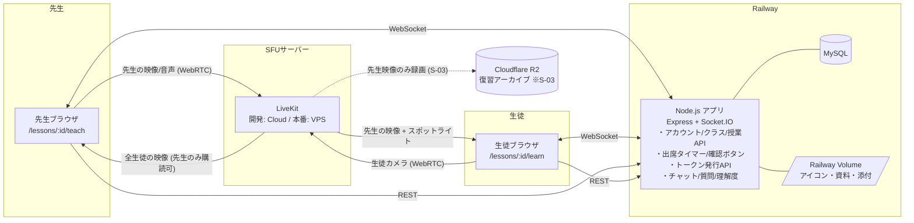

# システム構成（チーム内作業用）v3

## 1. 全体像



**覚え方：映像はSFU経由の高速レーン、それ以外は全部Railway経由の一般道、鍵はサーバーの金庫から出さない。生徒の映像は先生にしか届かない。**

## 2. なぜこの構成か

### 映像の流れ（v3で変更）
- **先生 → 全員**：先生の画面/カメラ映像を SFU が全生徒に配る（1対多）
- **生徒 → 先生のみ**：生徒のカメラ映像も SFU に送るが、購読できるのは先生だけ。
  LiveKit の**トラック購読許可**（送信側が「誰に見せるか」を指定）とサーバー発行トークンで強制する
- **スポットライト**：先生が指定した生徒の映像だけ、購読許可を全員に広げて表示
- 帯域：生徒映像は低画質（〜300kbps）に絞り、30人でも先生側受信は 10Mbps 前後に収める

### SFU を Railway の外に出す理由（v2 と同じ）
- WebRTC の映像は UDP が基本で、Railway は HTTP/TCP 前提のため UDP を通せない
- 開発中は LiveKit Cloud、本番は VPS に LiveKit OSS 版を自前構築（同一SDKで移行容易）

### ストレージの使い分け
| ストレージ | 置くもの | 理由 |
|---|---|---|
| Railway Volume | アイコン、授業内資料、チャット添付（画像/PDF/Office、10MBまで） | 再デプロイで消えない永続ディスク。小容量なら十分 |
| Cloudflare R2（S-03） | 復習アーカイブ動画（先生映像のみ） | 動画向き。配信転送料無料、無料枠10GB |

### Railway に載せるもの
- アカウント・クラス・授業・出席・質問・資料の REST API
- トークン発行 API（LiveKit の APIシークレットはサーバー側のみ）
- Socket.IO（チャット／理解度集計／挙手／確認ボタン／出席状態の配信）
- **出席タイマー**（1分間隔で一時退出→欠課を自動判定）、確認ボタンの自動発動、アーカイブ期限掃除（S-03）
- MySQL

## 3. NAT越え対策（本番VPS構築時の必須要件）

**授業アプリなので、学校ネットワークがそのまま本番環境になる。** v2 以上に重要。

- STUN / TURN を構成し、**TURN over TCP/TLS（443番ポート）フォールバック**を有効化
- 学校ネットワークでの疎通テストを**先生側・生徒側の両方**で早期に実施（生徒側は送信もするため）
- デモ当日の保険：テザリング切替手順、録画

## 4. 環境一覧

| 環境 | 用途 | 場所 |
|---|---|---|
| ローカル | 各自の開発 | 各自PC |
| 開発/検証 | 結合テスト・実機テスト | Railway ＋ LiveKit Cloud |
| 本番（発表用） | デモ | Railway ＋ VPS(LiveKit OSS) |

## 5. リポジトリ構成（案）

```
Sotsuken/
├── CLAUDE.md
├── package.json           # 依存パッケージとスクリプト（start / dev / migrate）
├── .env.example
├── railway.json           # Railway のデプロイ設定（ヘルスチェック）
├── docs/                  # 設計書。docs/design/ は画面デザイン（HTMLモック）
├── server/
│   ├── src/
│   │   ├── index.js       # 起動口（HTTP + Socket.IO）
│   │   ├── app.js         # Express アプリ
│   │   ├── routes/        # REST
│   │   ├── sockets/       # Socket.IO ハンドラ
│   │   ├── jobs/          # 出席タイマー・自動確認・期限掃除
│   │   ├── middleware/    # 認証・エラー
│   │   └── db/            # 接続プール・マイグレーション実行
│   └── migrations/        # 番号付き .sql
├── public/
│   ├── auth/              # ログイン・登録
│   ├── classes/           # クラス一覧・詳細
│   ├── teach/             # 先生画面
│   ├── learn/             # 生徒画面
│   └── shared/            # チャット・質問箱・ロールバッジ等の共通部品
└── infra/                 # 本番SFU構築手順
```

> フロントはフレームワーク無し（ビルド不要の素の HTML/CSS/JS）。画面デザイン（`docs/design/`）をそのまま土台にする。
> **2026-10-07 追記**：並列開発の試作（docs/10）では `client/`（Vite + React）で実装する。本番でどちらにするかは初回MTGで再判断。
