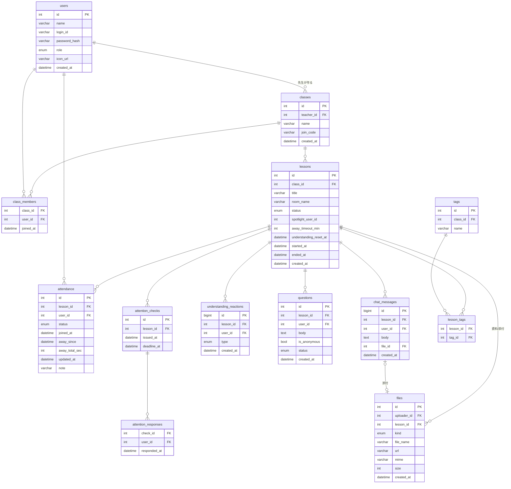

# DB設計（チーム内作業用）v4

> v3：授業特化（クラス・授業・出席・確認・理解度・質問・資料）に全面改訂。
> v4：出席に累積退出時間を追加、授業タグ（tags / lesson_tags）を追加。
> v4.1（2026-10-05）：出席の判定SQLを確定（lessons の閾値参照・UTC統一・復帰時の閾値判定・授業終了時の確定・未入室の扱い）。`attendance.joined_at` を NULL 可に変更、`lessons.understanding_reset_at` を追加。
> MySQL 8 / `utf8mb4` / **日時カラムはすべて UTC**（表示時のみJST変換）。

## 1. ER図（MVP）



## 2. テーブル定義（MVP）

### users
| カラム | 型 | 制約 | 説明 |
|---|---|---|---|
| id | INT | PK | |
| name | VARCHAR(30) | NOT NULL | 表示名 |
| login_id | VARCHAR(50) | NOT NULL, UNIQUE | |
| password_hash | VARCHAR(255) | NOT NULL | bcrypt |
| role | ENUM('teacher','student') | NOT NULL | ロールバッジ・権限判定に使用 |
| icon_url | VARCHAR(255) | NULL | 配信 URL（`/uploads/<乱数名>`）。実体は Railway Volume に保存（2026-10-08 監査で説明を修正） |
| created_at | DATETIME | NOT NULL | |

### classes / class_members
| classes | 型 | 制約 | 説明 |
|---|---|---|---|
| id | INT | PK | |
| teacher_id | INT | FK(users), NOT NULL | 作成した先生 |
| name | VARCHAR(50) | NOT NULL | |
| join_code | VARCHAR(8) | NOT NULL, UNIQUE | 参加コード（英数字、推測困難） |
| created_at | DATETIME | NOT NULL | |

| class_members | 型 | 制約 |
|---|---|---|
| class_id / user_id | INT | FK, 複合PK |
| joined_at | DATETIME | NOT NULL |

> 授業へのアクセス判定は「class_members に居る or 先生本人」。それ以外は 403。

### lessons（授業）
| カラム | 型 | 制約 | 説明 |
|---|---|---|---|
| id | INT | PK | |
| class_id | INT | FK, NOT NULL | |
| title | VARCHAR(100) | NOT NULL | |
| room_name | VARCHAR(100) | NOT NULL, UNIQUE | LiveKit ルーム名 |
| status | ENUM('preparing','live','ended') | NOT NULL, DEFAULT 'preparing' | **1クラス同時1授業**：開始時に live が無いことをトランザクション内で確認 |
| spotlight_user_id | INT | FK(users), NULL | スポットライト中の生徒。NULLで解除 |
| away_timeout_min | INT | NOT NULL, DEFAULT 15 | 欠課判定の閾値（分）。**退出時間の累積**と比べる（先生が変更可） |
| understanding_reset_at | DATETIME | NULL | 理解リアクションを最後にリセットした時刻（v4.1）。NULL は未リセット |
| started_at / ended_at | DATETIME | NULL | ended_at はアーカイブ期限の基準日 |
| created_at | DATETIME | NOT NULL, DEFAULT UTC | 作成時刻。開始前の授業の並び順に使う（2026-10-08 監査で追記。migration 001 に既存） |

### attendance（出席）
| カラム | 型 | 制約 | 説明 |
|---|---|---|---|
| id | INT | PK | |
| lesson_id / user_id | INT | FK, UNIQUE(lesson_id,user_id) | 1授業1生徒1行 |
| status | ENUM('present','away','absent') | NOT NULL | 出席／一時退出／欠課 |
| joined_at | DATETIME | NULL | 初回入室。**一度も入室しないまま授業が終了した生徒は NULL**（v4.1） |
| away_since | DATETIME | NULL | 現在の一時退出（または切断）開始時刻。復帰でNULL |
| away_total_sec | INT | NOT NULL, DEFAULT 0 | **累積退出秒数（v4）**。復帰のたびに今回分を加算 |
| updated_at | DATETIME | NOT NULL | |
| note | VARCHAR(100) | NULL | 先生の手動修正メモ |

> インデックス：`INDEX(status)`（`idx_attendance_status`。出席タイマーが away の行を探す用）（2026-10-08 監査で追記。migration 001 に既存）

**状態遷移（v4：累積方式）**
- 出席を記録するのは**授業が `live` の間だけ**。開始前（`preparing`）の待機画面での接続では記録しない。
  授業開始時に、その時点で接続中の生徒を `present` で記録する
- 入室 → `present`（行が無ければ作成）
- 一時退出ボタン or 接続切断 → `away`（`away_since` 記録）
- 残り時間（画面表示用）＝ `away_timeout_min*60 − away_total_sec − (現在時刻 − away_since)`
- 先生の手動修正はどの状態からでも可（note に理由）

**判定SQL（v4.1 確定）**
時刻は `NOW()` ではなく **`UTC_TIMESTAMP()`** を使う（DB接続のタイムゾーン設定に左右されないようにする）。
`SET` の中は左から順に評価させたいので、**JOIN を使わない単一テーブルの UPDATE** で書く
（複数テーブル UPDATE は代入の順序が保証されず、`away_since` を先に NULL にされると加算が壊れる）。

1. 復帰（「戻る」or 再接続）：累積＋今回分が閾値未満のときだけ出席に戻す

```sql
UPDATE attendance
SET away_total_sec = away_total_sec + TIMESTAMPDIFF(SECOND, away_since, UTC_TIMESTAMP()),
    status = 'present', away_since = NULL, updated_at = UTC_TIMESTAMP()
WHERE lesson_id = ? AND user_id = ? AND status = 'away'
  AND away_total_sec + TIMESTAMPDIFF(SECOND, away_since, UTC_TIMESTAMP()) < ? * 60;  -- ? = away_timeout_min
```

   更新が 0 行だったら（閾値以上 or 既に欠課）、下の 2 をその生徒に対して実行してから 409 `ALREADY_ABSENT` を返す。
   タイマーは1分間隔なので、**残り 0:00 を過ぎた復帰をここで止める**（タイマー待ちの最大59秒のすき間をなくす）。

2. サーバータイマー（1分間隔）：開催中の授業で、累積＋今回分が閾値以上になった退出中の生徒を欠課にする

```sql
UPDATE attendance a
SET a.away_total_sec = a.away_total_sec + TIMESTAMPDIFF(SECOND, a.away_since, UTC_TIMESTAMP()),
    a.status = 'absent', a.away_since = NULL, a.updated_at = UTC_TIMESTAMP()
WHERE a.status = 'away'
  AND a.away_total_sec + TIMESTAMPDIFF(SECOND, a.away_since, UTC_TIMESTAMP())
      >= (SELECT l.away_timeout_min * 60 FROM lessons l WHERE l.id = a.lesson_id AND l.status = 'live');
```

   - 欠課にした時点で今回の経過も累積に足し、`away_since` は NULL に戻す
   - 終了済みの授業はサブクエリが NULL になるので対象外
   - 条件付き UPDATE なので、復帰処理とすれ違っても誤判定しない
   - `attendance:update` を送るため、実装では先に対象の id を SELECT し、同じ条件で1行ずつ UPDATE して、更新できた行だけ通知する

3. 授業終了時（`POST /api/lessons/:id/end` のトランザクション内）：**最終結果は出席／欠課の2値に確定する**

```sql
-- (a) 退出中の生徒：今回分を足し、累積が閾値以上なら欠課、未満なら出席
UPDATE attendance
SET status = IF(away_total_sec + TIMESTAMPDIFF(SECOND, away_since, UTC_TIMESTAMP()) >= ? * 60, 'absent', 'present'),
    away_total_sec = away_total_sec + TIMESTAMPDIFF(SECOND, away_since, UTC_TIMESTAMP()),
    away_since = NULL, updated_at = UTC_TIMESTAMP()
WHERE lesson_id = ? AND status = 'away';

-- (b) 一度も入室しなかったクラスメンバー：欠課の行を作る（joined_at は NULL）
INSERT INTO attendance (lesson_id, user_id, status, joined_at, away_total_sec, updated_at)
SELECT ?, cm.user_id, 'absent', NULL, 0, UTC_TIMESTAMP()
FROM class_members cm
WHERE cm.class_id = ?
  AND NOT EXISTS (SELECT 1 FROM attendance a WHERE a.lesson_id = ? AND a.user_id = cm.user_id);
```

   - 終了後に `away` の行は残らない（終了間際の回線切断で損をしない／累積ルールと一貫する）
   - 授業中の出席一覧では、行がまだ無いメンバーを「未入室（`status:'absent'`, `joined_at:null`）」として返す。遅れて入室すれば `present` になる

### attention_checks / attention_responses（確認ボタン）
| attention_checks | 型 | 説明 |
|---|---|---|
| id | INT PK | |
| lesson_id | INT FK | |
| issued_at | DATETIME | 発動時刻 |
| deadline_at | DATETIME | 既定 issued_at+60秒 |

| attention_responses | 型 | 説明 |
|---|---|---|
| check_id / user_id | INT FK, 複合PK | 応答した生徒 |
| responded_at | DATETIME | deadline 以内のみ受理 |

> 未応答者＝該当 lesson の present 生徒のうち responses に無い者。先生画面で一覧表示。

### understanding_reactions（理解リアクション）
| カラム | 型 | 説明 |
|---|---|---|
| id | BIGINT PK | |
| lesson_id / user_id | INT FK | |
| type | ENUM('understood','confused','again') | わかった／わからない／もう一度 |
| created_at | DATETIME | INDEX(lesson_id, created_at)。S-01 の時系列集計にも使う |

> **集計の定義（v4.1）**：先生画面の「現在の集計」は、`lessons.understanding_reset_at`（NULL なら授業開始）**以降の、各生徒の最新のリアクション1件**を数える。
> リセットは `understanding_reset_at` を現在時刻に更新するだけで、行は消さない（授業結果の合計と S-01 の時系列で使うため）。
> 授業結果画面の「合計」は、その授業の全リアクションの件数。

### questions（質問箱・挙手）
| カラム | 型 | 説明 |
|---|---|---|
| id | INT PK | |
| lesson_id / user_id | INT FK | 投稿者（匿名でもDBには保持。先生のみ閲覧可） |
| body | TEXT | 質問本文。**挙手のみ（質問ボタン）は body NULL** |
| is_anonymous | BOOL | 他の生徒には投稿者を表示しない |
| status | ENUM('open','answered') | 先生が「回答済み」に変更 |
| created_at | DATETIME | INDEX(lesson_id, created_at)（`idx_questions_lesson`。2026-10-08 監査で追記。migration 001 に既存） |

### chat_messages（雑談チャット）
| カラム | 型 | 説明 |
|---|---|---|
| id | BIGINT PK | |
| lesson_id / user_id | INT FK | |
| body | TEXT NULL | テキスト（添付のみの投稿はNULL） |
| file_id | INT FK(files) NULL | 添付ファイル |
| created_at | DATETIME | INDEX(lesson_id, created_at) |

### tags / lesson_tags（授業タグ・v4）
| tags | 型 | 制約 | 説明 |
|---|---|---|---|
| id | INT | PK | |
| class_id | INT | FK(classes), NOT NULL | クラスごとにタグを管理（他クラスとは共有しない） |
| name | VARCHAR(30) | NOT NULL, UNIQUE(class_id, name) | 科目・単元など |

| lesson_tags | 型 | 制約 |
|---|---|---|
| lesson_id / tag_id | INT | FK, 複合PK |

> 授業作成・編集時に先生がタグを付ける（既存タグから選択 or 新規入力）。
> アーカイブ（S-03）は授業に紐づくため、授業のタグがそのままアーカイブのタグになる。

### files（資料・添付の共通テーブル）
| カラム | 型 | 説明 |
|---|---|---|
| id | INT PK | |
| uploader_id | INT FK(users) | |
| lesson_id | INT FK(lessons) | 紐づく授業 |
| kind | ENUM('material','attachment') | 授業内資料 / チャット添付 |
| file_name / url / mime / size | | url は配信 URL（`/uploads/<乱数名>`）。実体は Railway Volume に保存。許可MIME：画像・PDF・Office文書。上限10MB（2026-10-08 監査で url の説明を修正） |
| created_at | DATETIME | |

> インデックス：`INDEX(lesson_id, kind)`（`idx_files_lesson_kind`。資料パネルの一覧用）（2026-10-08 監査で追記。migration 001 に既存）

> 資料・添付は授業終了後も保持する。先生は自分がアップした資料を削除可。授業・クラス削除時はファイル本体ごと削除（ON DELETE CASCADE ＋ Volume上のファイル削除）。

## 3. ストレッチ用テーブル（今は作らない）

| テーブル | 対応機能 | メモ |
|---|---|---|
| quizzes / quiz_questions / quiz_answers | S-02 ミニテスト | 選択式のみ |
| archives | S-03 復習アーカイブ | v2 の定義を継承。visibility は 'class' / 'private' の2値に簡略化。タグは lessons 経由（lesson_tags）で参照 |
| assignments / submissions | S-04 課題 | files テーブルを再利用 |
| breakout_rooms / breakout_members | S-07 部屋分け | LiveKit の別ルームに対応 |

> **確認ボタンの自動発動設定（`interval_min`）はテーブルを作らず、サーバーのメモリに保持する**（再起動で消える）。永続化するときは lessons に列を足す（docs/04 §6、pending #3）。
> **既知の制約**：確認が自動発動かどうか（`GET /lessons/:id/attention` の `auto`）もメモリ保持のため、サーバーを再起動すると過去の確認はすべて `auto:false` になる。永続化はストレッチ案（`attention_checks` に `is_auto` 列、`lessons` に `attention_interval_min` 列を足すマイグレーション）。

## 4. 運用ルール

- スキーマ変更は `server/migrations/` 経由。直接 ALTER 禁止。同じ PR でこの文書を更新
- 日時は UTC 保存
- 個人情報はログインID・表示名・アイコン・出席記録に留める。生徒映像は保存しない
